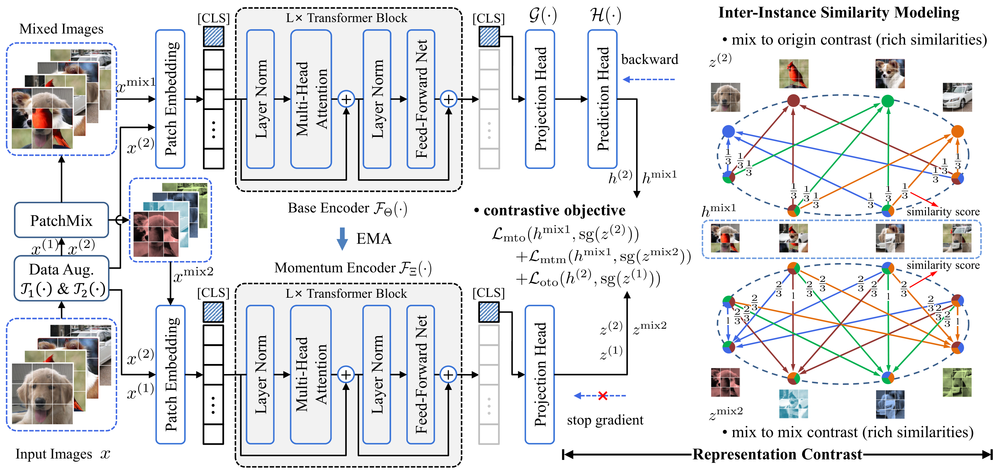
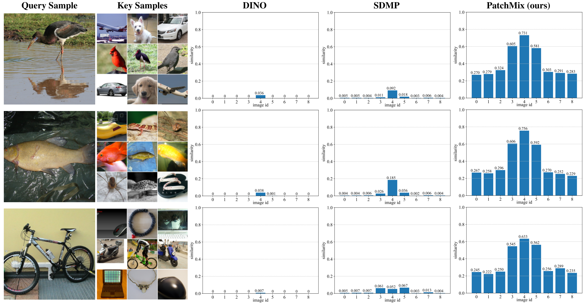

## Inter-Instance Similarity Modeling for Contrastive Learning

### 1. Introduction

This is the official implementation of paper: "Inter-Instance Similarity Modeling for Contrastive Learning".



PatchMix is a novel image mix strategy, which mixes multiple images in patch level. The mixed image contains massive local components from multiple images and efficiently simulates rich similarities among natural images in an unsupervised manner. To model rich inter-instance similarities among images, the contrasts between mixed images and original ones, mixed images to mixed ones, and original images to original ones are conducted to optimize the ViT model. Experimental results demonstrate that our proposed method significantly outperforms the previous state-of-the-art on both ImageNet-1K and CIFAR datasets, e.g., 3.0% linear accuracy improvement on ImageNet-1K and 8.7% kNN accuracy improvement on CIFAR100.

[[Paper](https://arxiv.org/abs/2306.12243)]    [[BibTex](#Citation)]    [[Blog(CN)](https://zhuanlan.zhihu.com/p/639240952)]

### 2. Requirements

```bash
conda create -n patchmix python=3.8
pip install -r requirements.txt
```


### 3. Datasets

Please set the root paths of dataset in the `*.py' configuration file under the directory: `./config/'.
 `CIFAR10`, `CIFAR100` datasets provided by `torchvision`. The root paths of data are set to `/path/to/dataset` . The root path of  `ImageNet-1K (ILSVRC2012)` is `/path/to/ILSVRC2012`


### 4. Self-Supervised Pretraining

#### ViT-Small with 2-node (8-GPU) training

Set hyperparameters, dataset and GPU IDs in `./config/pretrain/vit_small_pretrain.py` and run the following command

```bash
python main_pretrain.py --arch vit-small
```


### 5. kNN Evaluation

Set hyperparameters, dataset and GPU IDs in `./config/knn/knn.py` and run the following command

```bash
python main_knn.py --arch vit-small --pretrained-weights /path/to/pretrained-weights.pth
```


### 6. Linear Evaluation

Set hyperparameters, dataset and GPU IDs in `./config/linear/vit_small_linear.py` and run the following command:

```bash
python main_linear.py --arch vit-small --pretrained-weights /path/to/pretrained-weights.pth
```


### 7.  Fine-tuning Evaluation

Set hyperparameters, dataset and GPUs in `./config/finetuning/vit_small_finetuning.py` and run the following command

```bash
python python main_finetune.py --arch vit-small --pretrained-weights /path/to/pretrained-weights.pth
```


### 8. Main Results and Model Weights

If you don't have an **mircosoft office account**, you can download the trained model weights by [this link](https://csueducn-my.sharepoint.com/:f:/g/personal/221258_csu_edu_cn/EsSud0DB_edBiODrZhDbNpsBwfTbpOkuJ_TKA6mTYSi6Dw).

If you have an **mircosoft office account**, you can download the trained model weights by the links in the following tables.

#### 8.1 ImageNet-1K

|     Arch     | Batch size | #Pre-Epoch | Finetuning Accuracy | Linear Probing Accuracy | kNN Accuracy |
|:------------:|:------:|:-----:|:------:|:--------:|:----------------------------------------------------------------------:|
|   ViT-S/16   |  1024  |  300  | 82.8% ([link](https://csueducn-my.sharepoint.com/personal/221258_csu_edu_cn/_layouts/15/onedrive.aspx?ga=1&id=%2Fpersonal%2F221258%5Fcsu%5Fedu%5Fcn%2FDocuments%2FOpenSource%2Fpatchmix%5Fweights%2Ffinetune%2Fimagenet%2D1k%2Fvit%2Dsmall%2D300%2D82%2E8%2Epth&parent=%2Fpersonal%2F221258%5Fcsu%5Fedu%5Fcn%2FDocuments%2FOpenSource%2Fpatchmix%5Fweights%2Ffinetune%2Fimagenet%2D1k)) |  77.4% ([link](https://csueducn-my.sharepoint.com/personal/221258_csu_edu_cn/_layouts/15/onedrive.aspx?ga=1&id=%2Fpersonal%2F221258%5Fcsu%5Fedu%5Fcn%2FDocuments%2FOpenSource%2Fpatchmix%5Fweights%2Flinear%2Fimagenet1k%2Fvit%2Dsmall%2D300%2D77%2E4%2Epth&parent=%2Fpersonal%2F221258%5Fcsu%5Fedu%5Fcn%2FDocuments%2FOpenSource%2Fpatchmix%5Fweights%2Flinear%2Fimagenet1k))  |   73.3% ([link](https://csueducn-my.sharepoint.com/personal/221258_csu_edu_cn/_layouts/15/onedrive.aspx?ga=1&id=%2Fpersonal%2F221258%5Fcsu%5Fedu%5Fcn%2FDocuments%2FOpenSource%2Fpatchmix%5Fweights%2Fpretrain%2Fimagenet1k%2Fvit%2Dsmall%2D300%2D73%2E3%2Epth&parent=%2Fpersonal%2F221258%5Fcsu%5Fedu%5Fcn%2FDocuments%2FOpenSource%2Fpatchmix%5Fweights%2Fpretrain%2Fimagenet1k))   |
|   ViT-B/16   |  1024  |  300  | 84.1% ([link](https://csueducn-my.sharepoint.com/personal/221258_csu_edu_cn/_layouts/15/onedrive.aspx?ga=1&id=%2Fpersonal%2F221258%5Fcsu%5Fedu%5Fcn%2FDocuments%2FOpenSource%2Fpatchmix%5Fweights%2Ffinetune%2Fimagenet%2D1k%2Fvit%2Dbase%2D300%2D84%2E1%2Epth&parent=%2Fpersonal%2F221258%5Fcsu%5Fedu%5Fcn%2FDocuments%2FOpenSource%2Fpatchmix%5Fweights%2Ffinetune%2Fimagenet%2D1k)) |  80.2% ([link](https://csueducn-my.sharepoint.com/personal/221258_csu_edu_cn/_layouts/15/onedrive.aspx?ga=1&id=%2Fpersonal%2F221258%5Fcsu%5Fedu%5Fcn%2FDocuments%2FOpenSource%2Fpatchmix%5Fweights%2Flinear%2Fimagenet1k%2Fvit%2Dbase%2D300%2D80%2E2%2Epth&parent=%2Fpersonal%2F221258%5Fcsu%5Fedu%5Fcn%2FDocuments%2FOpenSource%2Fpatchmix%5Fweights%2Flinear%2Fimagenet1k))  | 76.2% ([link](https://csueducn-my.sharepoint.com/personal/221258_csu_edu_cn/_layouts/15/onedrive.aspx?ga=1&id=%2Fpersonal%2F221258%5Fcsu%5Fedu%5Fcn%2FDocuments%2FOpenSource%2Fpatchmix%5Fweights%2Fpretrain%2Fimagenet1k%2Fvit%2Dbase%2D300%2D76%2E2%2Epth&parent=%2Fpersonal%2F221258%5Fcsu%5Fedu%5Fcn%2FDocuments%2FOpenSource%2Fpatchmix%5Fweights%2Fpretrain%2Fimagenet1k))  |


#### 8.2 CIFAR10

|  Arch   | Batch size | #Pre-Epoch |                     Finetuning Accuracy                      |                   Linear Probing Accuracy                    |                         kNN Accuracy                         |
| :-----: | :--------: | :--------: | :----------------------------------------------------------: | :----------------------------------------------------------: | :----------------------------------------------------------: |
| ViT-T/2 |    512     |    800     | 97.5% ([link](https://csueducn-my.sharepoint.com/personal/221258_csu_edu_cn/_layouts/15/onedrive.aspx?ga=1&id=%2Fpersonal%2F221258%5Fcsu%5Fedu%5Fcn%2FDocuments%2FOpenSource%2Fpatchmix%5Fweights%2Ffinetune%2Fcifar10%2Fvit%2Dtiny%2D800%2D97%2E5%2Epth&parent=%2Fpersonal%2F221258%5Fcsu%5Fedu%5Fcn%2FDocuments%2FOpenSource%2Fpatchmix%5Fweights%2Ffinetune%2Fcifar10)) | 94.4% ([link](https://csueducn-my.sharepoint.com/personal/221258_csu_edu_cn/_layouts/15/onedrive.aspx?ga=1&id=%2Fpersonal%2F221258%5Fcsu%5Fedu%5Fcn%2FDocuments%2FOpenSource%2Fpatchmix%5Fweights%2Flinear%2Fcifar10%2Fvit%2Dtiny%2D800%2D94%2E4%2Epth&parent=%2Fpersonal%2F221258%5Fcsu%5Fedu%5Fcn%2FDocuments%2FOpenSource%2Fpatchmix%5Fweights%2Flinear%2Fcifar10)) | 92.9% ([link](https://csueducn-my.sharepoint.com/personal/221258_csu_edu_cn/_layouts/15/onedrive.aspx?ga=1&id=%2Fpersonal%2F221258%5Fcsu%5Fedu%5Fcn%2FDocuments%2FOpenSource%2Fpatchmix%5Fweights%2Fpretrain%2Fcifar10%2Fvit%2Dtiny%2D800%2D92%2E9%2Epth&parent=%2Fpersonal%2F221258%5Fcsu%5Fedu%5Fcn%2FDocuments%2FOpenSource%2Fpatchmix%5Fweights%2Fpretrain%2Fcifar10)) |
| ViT-S/2 |    512     |    800     | 98.1% ([link](https://csueducn-my.sharepoint.com/personal/221258_csu_edu_cn/_layouts/15/onedrive.aspx?ga=1&id=%2Fpersonal%2F221258%5Fcsu%5Fedu%5Fcn%2FDocuments%2FOpenSource%2Fpatchmix%5Fweights%2Ffinetune%2Fcifar10%2Fvit%2Dsmall%2D800%2D98%2E1%2Epth&parent=%2Fpersonal%2F221258%5Fcsu%5Fedu%5Fcn%2FDocuments%2FOpenSource%2Fpatchmix%5Fweights%2Ffinetune%2Fcifar10)) | 96.0% ([link](https://csueducn-my.sharepoint.com/personal/221258_csu_edu_cn/_layouts/15/onedrive.aspx?ga=1&id=%2Fpersonal%2F221258%5Fcsu%5Fedu%5Fcn%2FDocuments%2FOpenSource%2Fpatchmix%5Fweights%2Flinear%2Fcifar10%2Fvit%2Dsmall%2D800%2D96%2E0%2Epth&parent=%2Fpersonal%2F221258%5Fcsu%5Fedu%5Fcn%2FDocuments%2FOpenSource%2Fpatchmix%5Fweights%2Flinear%2Fcifar10)) | 94.6% ([link](https://csueducn-my.sharepoint.com/personal/221258_csu_edu_cn/_layouts/15/onedrive.aspx?ga=1&id=%2Fpersonal%2F221258%5Fcsu%5Fedu%5Fcn%2FDocuments%2FOpenSource%2Fpatchmix%5Fweights%2Fpretrain%2Fcifar10%2Fvit%2Dsmall%2D800%2D94%2E6%2Epth&parent=%2Fpersonal%2F221258%5Fcsu%5Fedu%5Fcn%2FDocuments%2FOpenSource%2Fpatchmix%5Fweights%2Fpretrain%2Fcifar10)) |
| ViT-B/2 |    512     |    800     | 98.3% ([link](https://csueducn-my.sharepoint.com/personal/221258_csu_edu_cn/_layouts/15/onedrive.aspx?ga=1&id=%2Fpersonal%2F221258%5Fcsu%5Fedu%5Fcn%2FDocuments%2FOpenSource%2Fpatchmix%5Fweights%2Ffinetune%2Fcifar10%2Fvit%2Dbase%2D800%2D98%2E3%2Epth&parent=%2Fpersonal%2F221258%5Fcsu%5Fedu%5Fcn%2FDocuments%2FOpenSource%2Fpatchmix%5Fweights%2Ffinetune%2Fcifar10)) | 96.6% ([link](https://csueducn-my.sharepoint.com/personal/221258_csu_edu_cn/_layouts/15/onedrive.aspx?ga=1&id=%2Fpersonal%2F221258%5Fcsu%5Fedu%5Fcn%2FDocuments%2FOpenSource%2Fpatchmix%5Fweights%2Flinear%2Fcifar10%2Fvit%2Dbase%2D800%2D96%2E6%2Epth&parent=%2Fpersonal%2F221258%5Fcsu%5Fedu%5Fcn%2FDocuments%2FOpenSource%2Fpatchmix%5Fweights%2Flinear%2Fcifar10)) | 95.8% ([link](https://csueducn-my.sharepoint.com/personal/221258_csu_edu_cn/_layouts/15/onedrive.aspx?ga=1&id=%2Fpersonal%2F221258%5Fcsu%5Fedu%5Fcn%2FDocuments%2FOpenSource%2Fpatchmix%5Fweights%2Fpretrain%2Fcifar10%2Fvit%2Dbase%2D800%2D95%2E8%2Epth&parent=%2Fpersonal%2F221258%5Fcsu%5Fedu%5Fcn%2FDocuments%2FOpenSource%2Fpatchmix%5Fweights%2Fpretrain%2Fcifar10)) |


#### 8.3 CIFAR100

|  Arch   | Batch size | #Pre-Epoch |                     Finetuning Accuracy                      |                   Linear  Probing Accuracy                   |                         kNN Accuracy                         |
| :-----: | :--------: | :--------: | :----------------------------------------------------------: | :----------------------------------------------------------: | :----------------------------------------------------------: |
| ViT-T/2 |    512     |    800     | 84.9% ([link](https://csueducn-my.sharepoint.com/personal/221258_csu_edu_cn/_layouts/15/onedrive.aspx?ga=1&id=%2Fpersonal%2F221258%5Fcsu%5Fedu%5Fcn%2FDocuments%2FOpenSource%2Fpatchmix%5Fweights%2Ffinetune%2Fcifar100%2Fvit%2Dtiny%2D800%2D84%2E6%2Epth&parent=%2Fpersonal%2F221258%5Fcsu%5Fedu%5Fcn%2FDocuments%2FOpenSource%2Fpatchmix%5Fweights%2Ffinetune%2Fcifar100)) | 74.7% ([link](https://csueducn-my.sharepoint.com/personal/221258_csu_edu_cn/_layouts/15/onedrive.aspx?ga=1&id=%2Fpersonal%2F221258%5Fcsu%5Fedu%5Fcn%2FDocuments%2FOpenSource%2Fpatchmix%5Fweights%2Flinear%2Fcifar100%2Fvit%2Dtiny%2D800%2D74%2E7%2Epth&parent=%2Fpersonal%2F221258%5Fcsu%5Fedu%5Fcn%2FDocuments%2FOpenSource%2Fpatchmix%5Fweights%2Flinear%2Fcifar100)) | 68.8% ([link](https://csueducn-my.sharepoint.com/personal/221258_csu_edu_cn/_layouts/15/onedrive.aspx?ga=1&id=%2Fpersonal%2F221258%5Fcsu%5Fedu%5Fcn%2FDocuments%2FOpenSource%2Fpatchmix%5Fweights%2Fpretrain%2Fcifar100%2Fvit%2Dtiny%2D800%2D68%2E8%2Epth&parent=%2Fpersonal%2F221258%5Fcsu%5Fedu%5Fcn%2FDocuments%2FOpenSource%2Fpatchmix%5Fweights%2Fpretrain%2Fcifar100)) |
| ViT-S/2 |    512     |    800     | 86.0% ([link](https://csueducn-my.sharepoint.com/personal/221258_csu_edu_cn/_layouts/15/onedrive.aspx?ga=1&id=%2Fpersonal%2F221258%5Fcsu%5Fedu%5Fcn%2FDocuments%2FOpenSource%2Fpatchmix%5Fweights%2Ffinetune%2Fcifar100%2Fvit%2Dsmall%2D800%2D86%2E0%2Epth&parent=%2Fpersonal%2F221258%5Fcsu%5Fedu%5Fcn%2FDocuments%2FOpenSource%2Fpatchmix%5Fweights%2Ffinetune%2Fcifar100)) | 78.7% ([link](https://csueducn-my.sharepoint.com/personal/221258_csu_edu_cn/_layouts/15/onedrive.aspx?ga=1&id=%2Fpersonal%2F221258%5Fcsu%5Fedu%5Fcn%2FDocuments%2FOpenSource%2Fpatchmix%5Fweights%2Flinear%2Fcifar100%2Fvit%2Dsmall%2D800%2D78%2E7%2Epth&parent=%2Fpersonal%2F221258%5Fcsu%5Fedu%5Fcn%2FDocuments%2FOpenSource%2Fpatchmix%5Fweights%2Flinear%2Fcifar100)) | 75.4% ([link](https://csueducn-my.sharepoint.com/personal/221258_csu_edu_cn/_layouts/15/onedrive.aspx?ga=1&id=%2Fpersonal%2F221258%5Fcsu%5Fedu%5Fcn%2FDocuments%2FOpenSource%2Fpatchmix%5Fweights%2Fpretrain%2Fcifar100%2Fvit%2Dsmall%2D800%2D75%2E4%2Epth&parent=%2Fpersonal%2F221258%5Fcsu%5Fedu%5Fcn%2FDocuments%2FOpenSource%2Fpatchmix%5Fweights%2Fpretrain%2Fcifar100)) |
| ViT-B/2 |    512     |    800     | 86.0% ([link](https://csueducn-my.sharepoint.com/personal/221258_csu_edu_cn/_layouts/15/onedrive.aspx?ga=1&id=%2Fpersonal%2F221258%5Fcsu%5Fedu%5Fcn%2FDocuments%2FOpenSource%2Fpatchmix%5Fweights%2Ffinetune%2Fcifar100%2Fvit%2Dbase%2D800%2D86%2E0%2Epth&parent=%2Fpersonal%2F221258%5Fcsu%5Fedu%5Fcn%2FDocuments%2FOpenSource%2Fpatchmix%5Fweights%2Ffinetune%2Fcifar100)) | 79.7% ([link](https://csueducn-my.sharepoint.com/personal/221258_csu_edu_cn/_layouts/15/onedrive.aspx?ga=1&id=%2Fpersonal%2F221258%5Fcsu%5Fedu%5Fcn%2FDocuments%2FOpenSource%2Fpatchmix%5Fweights%2Flinear%2Fcifar100%2Fvit%2Dbase%2D800%2D79%2E7%2Epth&parent=%2Fpersonal%2F221258%5Fcsu%5Fedu%5Fcn%2FDocuments%2FOpenSource%2Fpatchmix%5Fweights%2Flinear%2Fcifar100)) | 75.7% ([link](https://csueducn-my.sharepoint.com/personal/221258_csu_edu_cn/_layouts/15/onedrive.aspx?ga=1&id=%2Fpersonal%2F221258%5Fcsu%5Fedu%5Fcn%2FDocuments%2FOpenSource%2Fpatchmix%5Fweights%2Fpretrain%2Fcifar100%2Fvit%2Dbase%2D800%2D75%2E7%2Epth&parent=%2Fpersonal%2F221258%5Fcsu%5Fedu%5Fcn%2FDocuments%2FOpenSource%2Fpatchmix%5Fweights%2Fpretrain%2Fcifar100)) |


### 9. The Visualization of Inter-Instance Similarities



The query sample and the image with id 4 in key samples are from the same category. The images with id 3 and 5 come from category similar to query sample.

### 10. License

This project is under the CC-BY-NC 4.0 license. See [LICENSE](LICENSE) for details.

### 11. Citation

```bibtex
@article{shen2023inter,
  author  = {Shen, Chengchao and Liu, Dawei and Tang, Hao and Qu, Zhe and Wang, Jianxin},
  title   = {Inter-Instance Similarity Modeling for Contrastive Learning},
  journal = {arXiv preprint arXiv:2306.12243},
  year    = {2023},
}
```

